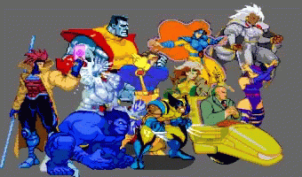
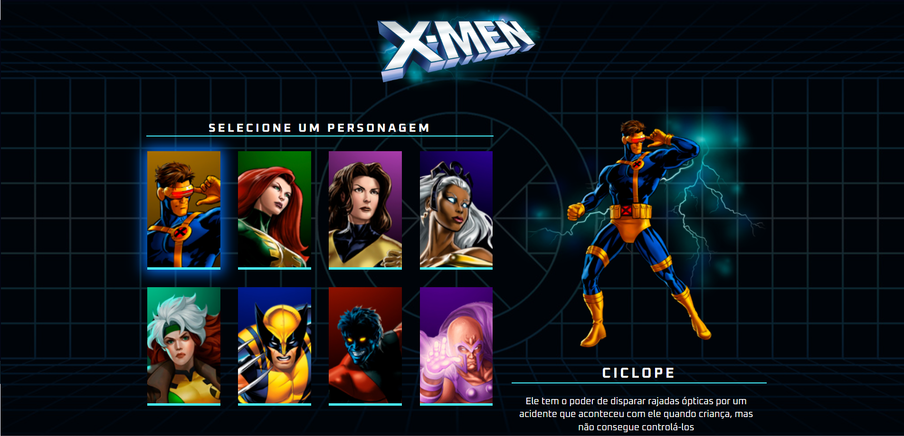

# X-Men '97 

Este é um site dedicado aos personagens da série animada X-Men '97, uma continuação direta da icônica série dos anos 90. Aqui você encontrará informações detalhadas sobre os heróis, vilões e anti-heróis que compõem o universo X-Men nesta nova iteração.

## Descrição

X-Men '97: Catálogo de Personagens é uma plataforma online projetada para fornecer aos fãs de X-Men informações abrangentes sobre os personagens apresentados na série. Desde os membros clássicos da equipe até os novos recrutas e adversários, meu objetivo é oferecer uma visão completa e atualizada do mundo dos X-Men.

## Funcionalidades

- Explorar  lista de personagens, incluindo, poderes e habilidades.
- Visualizar imagens e ilustrações.
- 
## Como Usar

1. Acesse o site X-Men
2. Navegue pela lista de personagens disponíveis clicando nos nomes ou imagens dos personagens.
3. Leia as biografias, descubra os poderes e habilidades de cada personagem e divirta-se explorando o vasto universo dos X-Men '97!

## Tecnologias Utilizadas

- HTML5
- CSS3
- JavaScript

## Contribuição

Contribuições são bem-vindas! Se você quiser contribuir para este projeto, siga estas etapas:

1. Fork o projeto.
2. Crie uma nova branch (`git checkout -b feature/nova-funcionalidade`).
3. Faça commit das suas alterações (`git commit -am 'Adicione uma nova funcionalidade'`).
4. Faça push para a branch (`git push origin feature/nova-funcionalidade`).
5. Abra um Pull Request.

## Visualização

Aqui está uma prévia de como o site aparece(Clique na imagem caso queira acessar o site)

## Contato

- E-mail: guisilvam19@gmail.com ou  guilhermemachado019@gmail.com
- Projeto Link: https://guilherme-silvam.github.io/site-x-men-97/